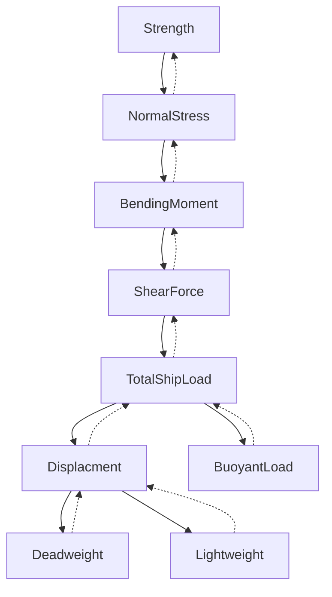

# ship_strength_monitoring_system

Система расчета прочности судна (прибор контроля прочности).

Назначение прибора контроля прочности:
 - задание оператором схемы загрузки судна;
 - построение эпюр внешних и внутренних силовых факторов;
 - расчет прочности судна в текущем состоянии загрузки;


Блок-схема расчета прочности корабля:



Вложенность объектов:
``` rust
Strenght {
    NormalStress {
        CrossSections,
        BendingMoment {
            SheareForce {
                TotalShipLoad {
                    Displacement {
                        Deadweight {},
                        Lightweight {
                            Ship{}
                        }
                    },
                    BouyanLoad {
                        Ship {},
                        BonjeanScale {}
                    }
                }
            }
        }
    }
}
```
