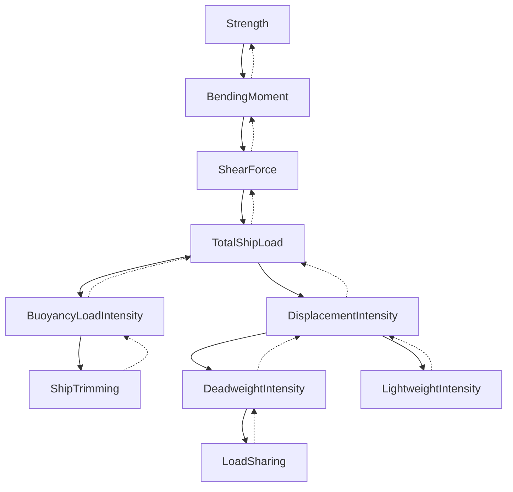

# ship_strength_monitoring_system

Cистема контроля прочности корабля (прибор контроля прочности).

Назначение прибора контроля прочности:
 - задание оператором схемы загрузки судна;
 - построение эпюр внешних и внутренних силовых факторов;
 - расчет прочности судна в текущем состоянии загрузки;

Блок-схема расчета прочности корабля:

